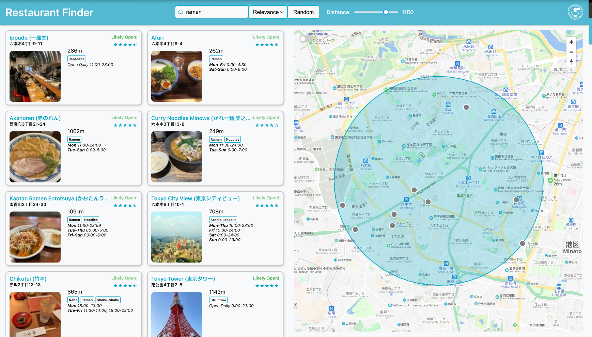
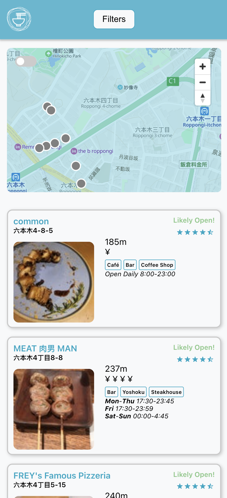

Restaurant Finder

A demo can be found [here](https://restaurant-finder-tokyo.netlify.app/ 'Go to demo').

<p align="center">
   
   
</p>

## Table of Contents

- [Uses](#uses)
- [Installation](#installation)
- [Development](#development)
- [Docker](#docker)
- [Linting & Formatting](#linting--formatting)
- [Packages](#packages)
- [Folder Structure](#folder-structure)
- [UI/UX](#ui-ux)
- [Issues](#issues)
- [Future Improvements](#future-improvements)
- [Notes](#notes)

## Uses

### Features

- Search by any text, will begin search when typing stops
- Sort by: Relevance, Rating, Distance via dropdown
- Random Button to call 50 restaurants within radius and choose 1 randomly
- Distance Slider: Steps of 50, range from 50-1500, updates after release
- Infinite Scrolling: Loads 10 at a time[\*](#issues) and will load 10 more when the user reaches the end of the scrollable list, if/when there are more to load.
- Item Details: When a marker tooltip or list item is clicked, it will bring up the details for that restaurant.
- Map ToggleSwitch: Switch between circles and named markers

## Installation

1. **Clone the repository:**

   git clone https://github.com/JamesScottCode/restaurant-finder.git

   cd into it

2. **Install dependencies**

   If you're using **npm** (npm v7+):

   npm install --legacy-peer-deps

   Or if you're using **Yarn**:

   yarn install

## Development

To run the application locally using Create React App:

npm start

Or if using Yarn:

yarn start

This will start the development server and open http://localhost:3000 in your browser.

## Docker

The project is Dockerized so you can run everything with a single command.

1. **Build and run the Docker container:**

   docker compose up --build

2. Open your browser at http://localhost:3000 to see the application running.

## Linting & Formatting

This project uses ESLint and Prettier to enforce code quality and formatting.

- **Lint:** To check for linting issues in your code:

  npm run lint

- **Format:** To automatically format your code:

  npm run format

_Note:_ If you encounter peer dependency conflicts with npm, use the `--legacy-peer-deps` flag as shown in the installation section.

## Packages

### Zustand

I find [zustand](https://zustand.docs.pmnd.rs/getting-started/introduction) boilerplate to be more minimalist than redux boilerplate. It's easier to pick up than redux and allows for hook-based usage opposed to HOC. By default, zustand uses selectors and avoids re-renders by default. For most applications it offers plenty, but for very large applications, by the nature of flexibility, it can become disorganized if the code is not structured and reviewed well.

[Zustand vs Redux](https://dev.to/ingeniouswebster/the-battle-of-state-management-redux-vs-zustand-6k4)

### React Map GL and Maplibre

These are free and open source map libraries for the map components in this app. They are easy to use with exisiting react functions like hooks and props/state cycles. They're also pretty customizable. [React-Map-GL](https://visgl.github.io/react-map-gl/) [MapLibre](https://maplibre.org/)

### Turf

This was added to help with the Geospatial overlays on the maps. Specifically, this is the radius circle on the map used in this application. It's really modular and customizable, so it can be used for other features if the application grows, such as drawing a boundary. [Turf](https://turfjs.org/)

## API

### Maptiler

I chose maptiler because it's open-source and free within their limits. It pairs well with MapLibre GL. It also has a Japan specific map for the detailed intricacies of small urban streets.

[Maptiler Japanese Specific Map](https://www.maptiler.com/news/2022/03/japanese-maps-just-got-way-better/)

### Foursquare API

It does not use traditional pagination, so it requires a little bit of a setup for this kind of behavior.

[Foursquare Places API](https://docs.foursquare.com/developer/reference/places-api-overview)

## Folder Structure

I chose to try [Atomic Design Methodology](https://atomicdesign.bradfrost.com/chapter-2/) for this application.

#### Pros

- Atomic design scales well: each folder serves a clear purpose, reducing the chance of “component dumping grounds.”
- Ecourages consitency: Developers don’t need to guess where to put or find a component. Naming conventions and structure stay uniform across teams.
- Improves Reusability and Maintenance: Since atoms and molecules are simple and generic, they tend to be highly reusable. You’re less likely to duplicate UI pieces, and easier to update them in one place.

#### Cons

- For a small project like this, I found it way too much abstraction. Some of my atoms could definitely be made simpler and and abstracted to strictly follow atomic design, but for a small project, it is abstraction for abstraction's sake and not necessarily an improvement in readability or usability.
- There's some subjectivity between when a component is downleveled or upleveled to another "tier".

#### Conclusion

For a very large application, this design pattern seems like a strategic method. For small applications, it seems overengineered and unnecessary.

```
project/
├── public/
│ └── index.html
├── src/
│ ├── actions/
│ ├── components/
    ├── atoms/           # Smallest building blocks
    ├── molecules/       # Combinations of atoms
    ├── organisms/       # Groups of molecules
    ├── templates/       # Page layouts with placeholders
    └── pages/           # Fully fleshed out pages composed of templates & components
│ ├── contexts/
│ ├── consts/
│ ├── stores/
│ ├── types/
│ ├── utils/
│ ├── App.tsx
│ └── index.tsx
├── .env
├── .gitignore
├── package.json
├── tsconfig.json
├── ... (etc..)
```

## UI UX

This project is loosely (or not so loosely) inspired by [Apts.jp](https://apts.jp/search)
The mention of a map being required and a list of restaurants immediately reminded me of this site, which follows a similar pattern, except with apartments.

#### UI Improvements

There is a lot of room for CSS/UI improvements. It's mostly responsive, but sometimes the stylings break or don't work as intended around tablet size. I could only virtually test the UI at large screen sizes as I built this on a small laptop screen. Given more time, some figma references, and a UI/UX designer and it could be polished further.

## Issues

- As mentioned in [UI/UX](#ui-ux), several UI/CSS improvements can be made.
- More extensive [Ad Hoc](https://www.browserstack.com/guide/adhoc-testing#:~:text=Ad%20hoc%20testing%20is%20a,testing%20methods%20may%20not%20find.) testing needed.
- \*On very large screens, at least simulated, the infinite scroller will trigger several times due to have more space to display items initially. Proposed solution: Use useScreenSize to adjust the load count from 10->~25.
- Currently, inputted text can return _any_ place, such as UNIQLO. Clothes aren't very tasty, so a filter should be added. Proposed Solution: Check Foursquare Documentation for the specific restaurant id. Hardcore for a temporary fix. (Use /categories endpoint to retreive the id for restaurants when implemented) \*note: A user has to specifically seek out non-restaurants for this "bug" to appear though, so it's a minor issue.

## Future Improvements

### General Improvements

- Feature: Add dropdown list for a user to select a restaurant by genre incase they aren't filling creative. Proposed Implmentation: Add new [categories](https://docs.foursquare.com/data-products/docs/categories) endpoint, fetch and populate the select dropdown with the restaurant sub-categories.
- Tests: Add more comprehensive and meaningful tests across the application
- Feature: Consider some type of route/navigation for the maps. [react-map-gl-directions](https://github.com/neeleshbisht99/react-map-gl-directions) is quite outdated but it's possible with investigation an alternative can be found. [OpenRouteService](https://openrouteservice.org/) is open-source and free. Others such as Google and Mapbox are paid.
- ~~Improvement: Better error handling. Possibly a toast notification for errors.~~
- Feature: Storybook for component visulzations/documentation
- Improvement: Make a folder for each component
- Improvement: Caching. Because of the "likey open" status effects, should be a short cache (30minutes?) time so users are disappointed by stale data. (Frontend Tanstack Query, maybe a combo or redis/nginx for a fullstack app)
- Fix: Fallback incase API keys are provided

### Super Strech Goals

- User System: Signup, authentication, save favorite locations, rate restaurants.
- [DBSCAN](https://en.wikipedia.org/wiki/DBSCAN): Implement DBSCAN algorithm on a downloaded set of restaurants to help find restaurant clusters that can be used with a heatmap overlay. This can help users see "hotpots" of restaurant (to their liking) areas that they can go to and explore in person.
- (assumes user system): Implement Recommender System: Use [KNN](https://en.wikipedia.org/wiki/K-nearest_neighbors_algorithm) as a starting point and extend from there.

## Notes

- The map background uses the free tier of maptiler. If the request limit is hit, it will default to the demo map. The demo map has virtually no detail so it will look like a solid background.
- This project doesn't have full test coverage, ad-hoc testing and probably contains bugs around edges cases. More testing in general is needed.
